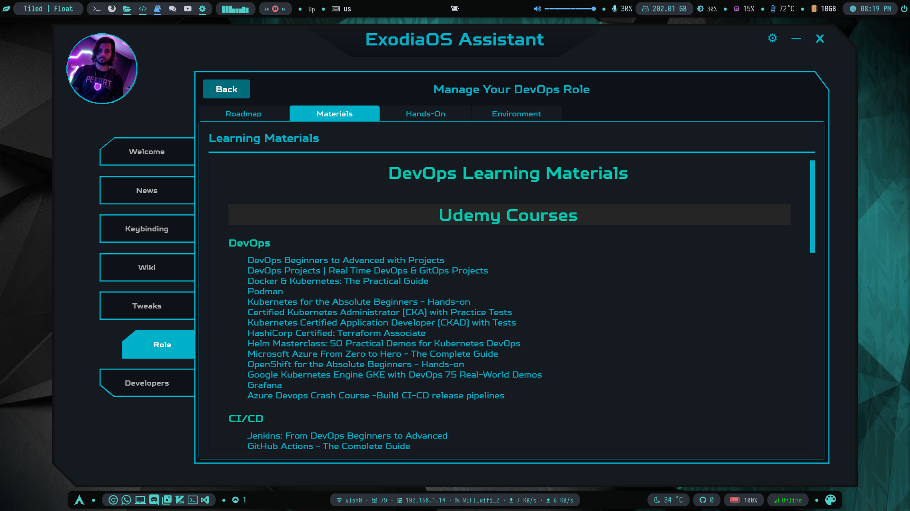

# 🚀 DevOps Learning Journey

A simple guide to start your journey in **DevOps**. I'm going to share with you my personal roadmap and the courses that helped me the most.

---

### 📘 Start Here: Beginner to Advanced

I highly recommend starting with this course:
👉 [**DevOps Beginners to Advanced with Projects**](https://www.udemy.com/course/decodingdevops)

It takes you through all the fundamental DevOps concepts and tools, and covers everything you need to get started.

---

### 🐳 Containerization & Orchestration (Docker & Kubernetes)

After grasping the basics, the next step is learning about **containerization** and **orchestration tools** like Docker and Kubernetes (K8s). Start with the following:

#### ✅ Recommended Courses:

* [Docker & Kubernetes: The Practical Guide](https://www.udemy.com/course/docker-kubernetes-the-practical-guide)
* [Kubernetes for the Absolute Beginners - Hands-on](https://www.udemy.com/course/learn-kubernetes)
* [Helm Masterclass: 50 Practical Demos for Kubernetes DevOps](https://www.udemy.com/course/helm-masterclass-50-practical-demos-for-kubernetes-devops)

#### 🔁 Advanced Kubernetes (Optional for Beginners – Useful After First Job):

* [Certified Kubernetes Administrator (CKA) with Practice Tests](https://www.udemy.com/course/certified-kubernetes-administrator-with-practice-tests)
* [Kubernetes Certified Application Developer (CKAD) with Tests](https://www.udemy.com/course/certified-kubernetes-application-developer)
* [OpenShift for the Absolute Beginners - Hands-on](https://www.udemy.com/course/learn-openshift) *(for certain job roles)*

---

### 🔄 CI/CD (Continuous Integration / Continuous Delivery)

You’ll get a solid introduction to **Jenkins** and **AWS CodePipeline** in the [DevOps Beginners to Advanced](https://www.udemy.com/course/decodingdevops) course.

To deepen your knowledge, I highly recommend:

#### ✅ Recommended Courses:

* [Azure DevOps Crash Course – Build CI/CD Release Pipelines](https://www.udemy.com/course/azure-devops-fundamental) *(Azure DevOps is in demand at many companies)*
* [GitHub Actions – The Complete Guide](https://www.udemy.com/course/github-actions-the-complete-guide)

#### ➕ Additional (Optional or Role-Specific):

* [GitLab CI/CD: Pipelines, CI/CD and DevOps for Beginners](https://www.udemy.com/course/gitlab-ci-pipelines-ci-cd-and-devops-for-beginners)
* [GitLab CI – A Complete Hands-On for CI/CD Pipelines & DevOps](https://www.udemy.com/course/gitlab-cicd-course)
* [DevOps: Build CI/CD Pipelines using Jenkins, Docker, Sonar](https://www.udemy.com/course/devops-cicd-with-jenkins-maven-gradle-sonarqube-docker-ansible)

---

### ⚙️ Infrastructure as Code (IaC)

You’ll get introduced to **Terraform** and **AWS CloudFormation** in the main DevOps course. But to go deeper:

#### ✅ Recommended Course:

* [HashiCorp Certified: Terraform Associate](https://www.udemy.com/course/terraform-beginner-to-advanced)

#### ➕ Optional:

* Explore [**Pulumi**](https://www.pulumi.com) *(alternative to Terraform, useful for specific job roles)*

---

## 📈 Monitoring & Observability

**Learn Monitoring Tools like Grafana and Prometheus:**
- [Prometheus MasterClass: Infra Monitoring & Alerting](https://www.udemy.com/course/prometheus-monitoring)

---

### 🌐 API & Web Basics

* [API and Web Service Introduction](https://www.udemy.com/course/api-and-web-service-introduction)

---

### 📈 Agile Methodology

* [Agile Fundamentals: Including Scrum & Kanban](https://www.udemy.com/course/agile-fundamentals-scrum-kanban-scrumban/)
* [Complete Agile Scrum Master Certification Training](https://www.udemy.com/course/complete-agile-scrum-master-training-exam-simulator/)

---

### 🗃️ Database Fundamentals

* [Fundamentals of Database Engineering](https://www.udemy.com/course/database-engines-crash-course)

---

### 🔐 DevSecOps (Security in DevOps)

* [DevSecOps Fundamentals – Including Hands-On Demos](https://www.udemy.com/course/devsecops-fundamentals)
* [DevSecOps & DevOps with Jenkins, Kubernetes, Terraform & AWS](https://www.udemy.com/course/devsecops-with-terraform-kubernetes-jenkins-aws)
* [Application Security – The Complete Guide](https://www.udemy.com/course/application-security-the-complete-guide)
* [DevSecOps – Kubernetes DevOps & Security with Hands-On Labs](https://www.udemy.com/course/kubernetes-devsecops)
* [Hands-On DevSecOps: Secure CI/CD with Jenkins on AWS](https://www.udemy.com/course/devsecops-with-sast-sca-dast)
* [AWS Security: DevSecOps & AWS Security Services & Terraform](https://www.udemy.com/course/devsecops-in-aws-and-aws-security-services-asecurityguru)

---

## 🧪 Projects & Hands-On Challenges

Theory is great, but practice is everything in DevOps. Here are **hands-on labs and real-world projects** to test your skills:

### 🧰 Labs & Interactive Practice

* 🔗 [**Iximiuz Labs** – Learn DevOps by Practicing in Live Environments](https://labs.iximiuz.com)
  *Explore challenges in Linux, Docker, networking, and Kubernetes with in-browser terminals.*

### 🔨 Real-World Projects

* 📦 [**DevOps Projects | Real Time DevOps & GitOps Projects**](https://www.udemy.com/course/devopsprojects)
  *Learn to build CI/CD pipelines, container-based deployments, infrastructure setups, and more.*

---

### 🎯 Optional but Useful (Based on Job Requirements)

* [Microsoft Azure From Zero to Hero – The Complete Guide](https://www.udemy.com/course/microsoft-azure-from-zero-to-hero-the-complete-guide)
* [Google Kubernetes Engine (GKE) with DevOps – 75 Real-World Demos](https://www.udemy.com/course/gcp-google-kubernetes-engine-gke-with-devops)
* [Podman (YouTube)](https://www.youtube.com/watch?v=YXfA5O5Mr18&ab_channel=AmadeusforDevelopers)

---

> 💡 **Tip:** You don't need to take every single course. Pick the ones relevant to your current level and job goals, and build gradually from there.

Good luck with your DevOps journey! 💻🔥

---
### 💻 DevOps Hands-On Exercises & Practice 

Now, let's get our hands dirty!

#### 🎓Udemy Practice Courses 
Begin your hands-on journey with these instructor-led project-based courses: 
- [DevOps Projects | Real Time DevOps & GitOps Projects](https://www.udemy.com/course/devopsprojects)
- [Helm Masterclass: 50 Practical Demos for Kubernetes DevOps](https://www.udemy.com/course/helm-masterclass-50-practical-demos-for-kubernetes-devops)
- [GCP GKE Google Kubernetes Engine DevOps 75 Real-World Demos](https://www.udemy.com/course/gcp-google-kubernetes-engine-gke-with-devops)

#### 🔧GitHub Projects Repositories 
Now you're ready to get your hands dirty! Explore these repositories for real-world DevOps projects:
- [Real-World DevOps Projects For Learning](https://github.com/techiescamp/devops-projects)
- [DevOps Real World Projects for Aspiring DevOps Engineers [Beginner to Advanced]](https://github.com/NotHarshhaa/DevOps-Projects)

#### 🧪Interactive Labs & Challenges 
Explore live environments, playgrounds, and cloud labs to practice DevOps technologies: 
- [Iximiuz Labs - Practice Docker, Kubernetes, Networking, and Linux](https://labs.iximiuz.com)
- [Katacoda - Interactive browser scenarios for Docker, K8s, Terraform, and Jenkins](https://www.katacoda.com)
- [KodeKloud - Labs for Docker, Kubernetes, Ansible, Terraform, Git](https://kodekloud.com)
- [Play with Docker - Online playground with shell and multi-node support](https://labs.play-with-docker.com)
- [Play with Kubernetes - Set up multi-node K8s clusters in your browser](https://labs.play-with-k8s.com)
- [ACG (Linux Academy) Free Tier - Hands-On CI/CD, Docker, Jenkins, AWS Labs](https://www.pluralsight.com/cloud-guru)
- [AWS Free Tier - Practice EC2, S3, and automation with Terraform or Ansible](https://aws.amazon.com/free)
- [Microsoft Learn - Free Azure DevOps Pipelines, ARM templates, etc.](https://learn.microsoft.com/en-us/training/azure)
- [Google Cloud Skills Boost - Labs on GKE, CI/CD, Terraform, challenges with credits](https://www.cloudskillsboost.google)

---

## 🐧 Use a Suitable Linux Distro

If you're diving into DevOps, choosing the right Linux distribution can make a big difference. One excellent option is [**Exodia OS**](https://exodia-os.github.io/), a highly customized, Arch-based distro tailored for cybersecurity professionals and developers.

Exodia OS comes with a built-in app also called **Exodia OS**, which includes a **"Role"** tab. This feature helps you:

- Learn and follow a guided path
- Manage your development environment
- Select a role based on your goals (e.g., DevOps, Pentester, Developer, etc.)

### 👤 DevOps Role in Exodia OS

When you select the **DevOps** role, you'll get access to:

#### 📌 Roadmap
A curated roadmap to guide your learning path step-by-step  

#### 📚 Materials
Hand-picked learning resources including books, videos, and courses  

#### 💻 Hands-On
Hands-On Exercises & Practice  

#### 🛠 Environment Setup
Automated setup scripts and configurations for DevOps tools  

---

By using **Exodia OS**, you reduce setup time and focus more on learning and building. It’s especially useful for those who prefer an out-of-the-box Linux environment for DevOps workflows.

