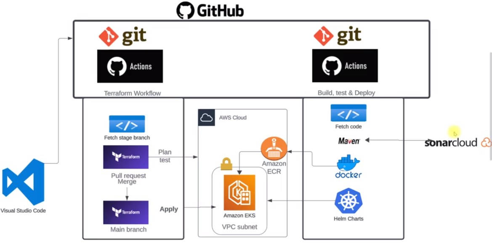

# Project Architecture

There are two Git repositories: Terraform Workflow (for development) and Application Workflow (for production).

- [Terraform Workflow](https://github.com/mmsaeed509/iac-vprofile) (to apply infrastructure-level changes):
  - It consists of two branches: Stage Branch and main Branch.
  - If any changes are added to the Stage Branch, workflows will detect these changes.
  - Then, Terraform will test these changes in AWS Cloud and validate them.
  - If the code is validated successfully, the changes will be merged into the main Branch via a Pull Request.
  - The Pull Request will then be validated and approved (approved by the owner of the main Branch).
  - Finally, this code will be applied to the infrastructure level (applied to AWS Cloud).

- [Application Workflow](https://github.com/mmsaeed509/vprofile-action) (Docker/Kubernetes Definition Files: This is to apply any change at the application level):
  - It fetches the code, builds it using Maven.
  - Tests and analyzes the code using SonarCloud.
  - Builds Docker images if validated successfully and uploads them to Amazon ECR (AWS Docker registry).
  - Then, using Helm to fetch the Docker images to the EKS Cluster and run the application.
