

   
<h3> quiz 1 </h3>

   - 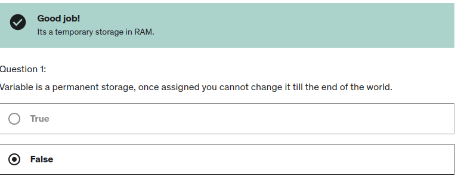
   - 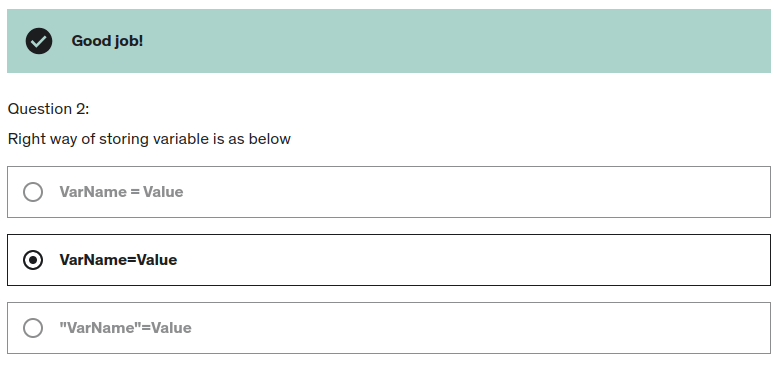
   - 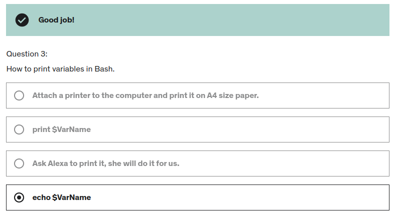

___

   
<h3> quiz 2 </h3>

- 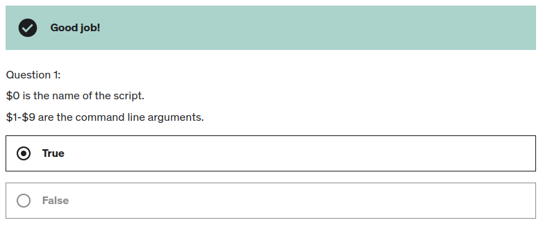
- 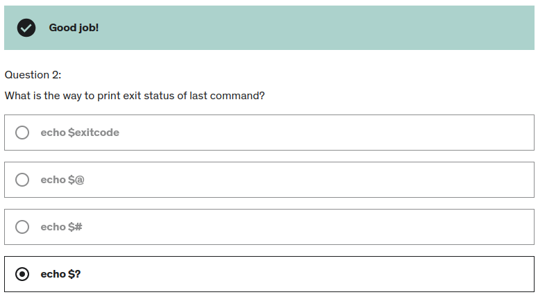
- 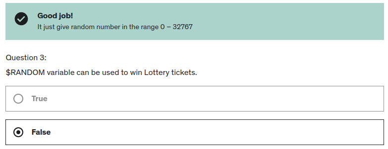

___

   
<h3> quiz 3 </h3>

- 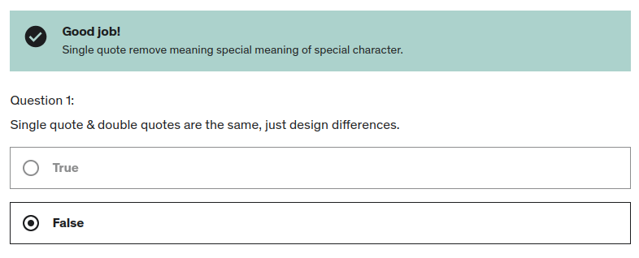
- 
- 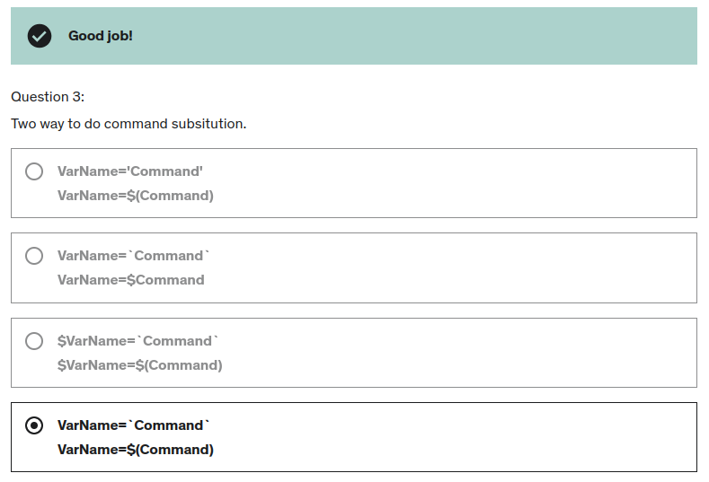

___

   
<h3> quiz 4 </h3>

- 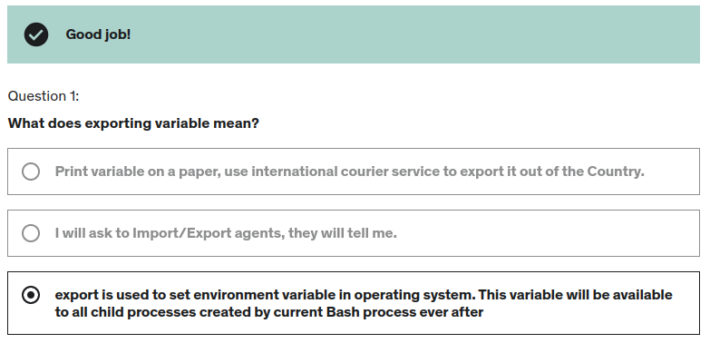
- 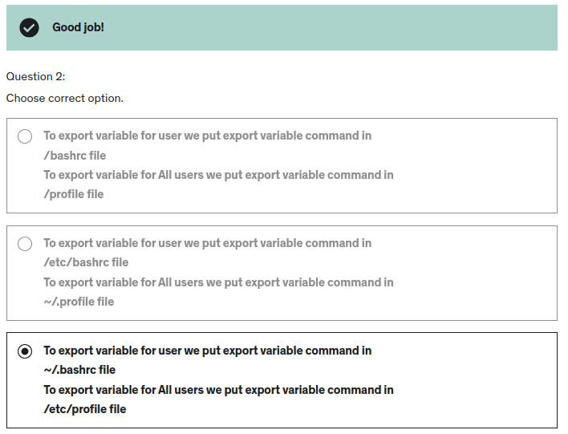

___

   
<h3> quiz 5 </h3>

- 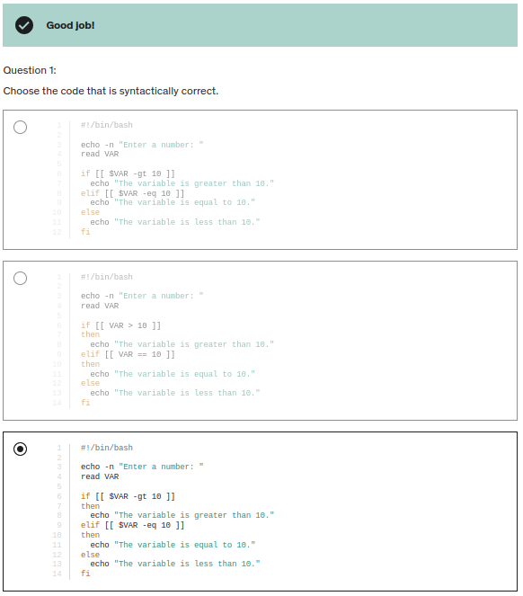

  - the 3rd is true because it contains `then`
    - 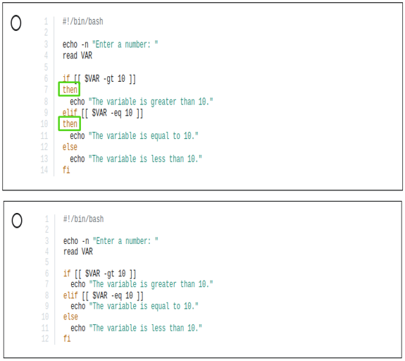

___

   
<h3> quiz 6 </h3>

- 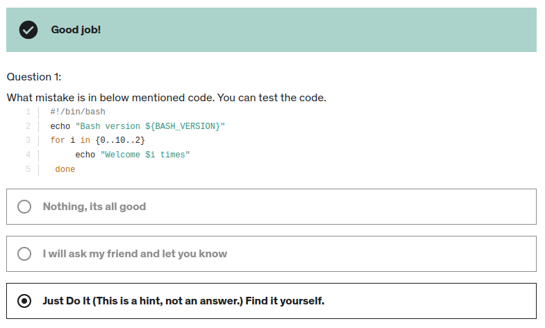
- 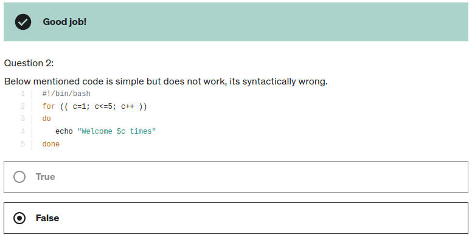
- 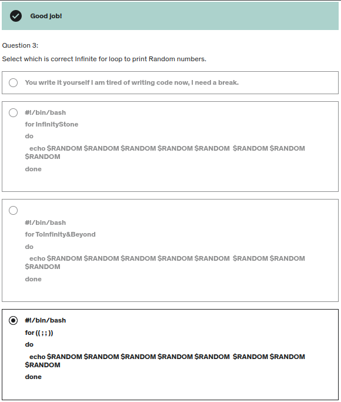

