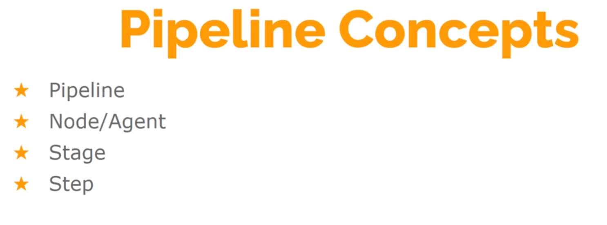

### Pipeline




### Install Jenkins (Ubuntu)

```bash

sudo -i

curl -fsSL https://pkg.jenkins.io/debian-stable/jenkins.io-2023.key | sudo tee \
/usr/share/keyrings/jenkins-keyring.asc > /dev/null

echo deb [signed-by=/usr/share/keyrings/jenkins-keyring.asc] \
https://pkg.jenkins.io/debian-stable binary/ | sudo tee \
/etc/apt/sources.list.d/jenkins.list > /dev/null

apt update

apt install openjdk-11-jdk openjdk-8-jdk awscli jenkins -y

```

___

### Create First Admin User

- Username `admin`
- Password `admin12345` 
- Full name `Jenkins Admin`
- E-mail address `admin@Jenkins`
- Jenkins [**`URL:`**](23.20.48.192:8080) (ip:8080)

___

### Nexus

- Username `admin`
- Password `admin12345`
- Nexus [**`URL:`**](54.160.83.678081) (ip:8081)

___

### Sonar

- Username `admin`
- Password `admin`
- Sonar [**`URL:`**](54.174.243.231) (ip)
- Tokens:
  -  `JenkinsAT` -> `4096bb477bee3756770dae5b0c133ebc85a4ad83`
- Sonar