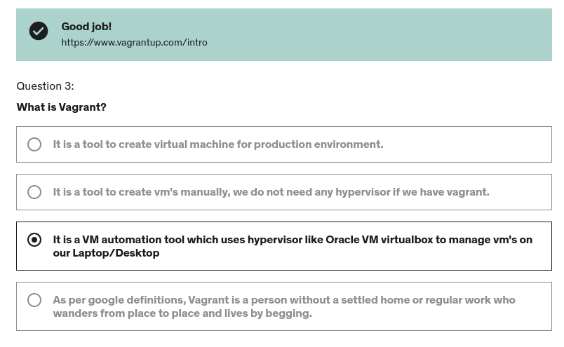

# vagrant

- create dirs `mkdir {CentOS,Ubuntu}`
- initialize VM `vagrant init eurolinux-vagrant/centos-stream-9`
- launch VM `vagrant up`
- list VMs `vagrant box list`
- show VM status `vagrant status`
- login to VM `vagrant ssh`
- close VM `vagrant halt`
- reboot VM `vagrant reload` (also for reload the new config of **`Vagrant`** file)
- delete teh VM `vagrant destroy`

# Quiz

- Question 1 [**`ans`**](https://www.vmware.com/topics/glossary/content/hypervisor.html)
  - 

- Question 2
  -  

- Question 3 [**`ans`**](https://www.vagrantup.com/intro)
  -  